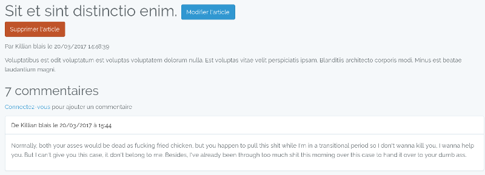

class: center, middle

# Framework PHP
## Campus Ynov - Mars 2017

---

# Présentation

- [@killianblais](https://twitter.com/killianblais) | [github.com/kblais](https://github.com/kblais)
- Développeur Backend chez [Startup Palace](https://www.startup-palace.com) :
    - Développeur Laravel depuis 3 ans (depuis Laravel 4.1)
    - Animateur du sujet qualité au sein de toute l'équipe de développement

.center[]

---

# Qu'est-ce qu'un framework ?

> Un framework [...] désigne un ensemble cohérent de composants logiciels structurels, qui sert à créer les fondations ainsi que les grandes lignes de tout ou d’une partie d'un logiciel (architecture).

Définition d'après [Wikipedia](https://fr.wikipedia.org/wiki/Framework)

- Ensemble de bibliothèques
- Générique (dans la limite des possibilités du langage)
- Cadre facilitant/guidant le travail du développeur

???

- Générique : le framework ne va pas vous limiter dans ce wue vous souhaitez faire

---

# Les frameworks en PHP

## Les principaux

- Zend Framework :
    - créé par un des développeurs de PHP en 2006 ([Zeev Suraski](https://twitter.com/zeevs))
    - utilisé dans Magento
- Symfony :
    - créé par [Fabien Potentier](https://twitter.com/fabpot) en 2005
    - maintenu par SensioLabs
- Laravel :
    - framework PHP moderne le plus jeune (2011)
- CodeIgniter
- CakePHP

???

- Zend :
    - lourd / usine à gaz
    - actuellement en version 3.0 (depuis juin 2016)
- Symfony :
    - SensioLabs société française
    - Le framework s'exporte aux US
    - Aujourd'hui utilisé par le CMS Drupal dans sa dernière version
- Laravel :
    - Jeune mais a beaucoup évolué depuis ses débuts
- CodeIgniter et CakePHP :
    - Inspirés de Ruby on Rails
    - 2006 et 2005

---

# Les frameworks en PHP

## Les moins connus

- Phalcon
- Yii

## Alternatives full API

- Lumen (Laravel)
- Silex (Symfony)
- Slim

???

- Phalcon :
    - librairie en C donnant accès à plus d'API
- Full API :
    - optimisé pour de hautes performances avec de nombreux appels HTTP par seconde
    - frameworks légers ("micro-framework")
- Lumen :
    - composants de Laravel sans le système de vue et l'ORM (activables)
- Silex :
    - composants de Symfony
    - l'un des plus performants
- Slim :
    - micro-framework le plus performant

---

# Les frameworks en PHP

## Pourquoi autant de choix ?

- Langage web [le plus utilisé](https://w3techs.com/) :
    - 82,5% de part de marché
    - Utilisé par des tenors du web: Wikipedia, Facebook, etc...
- Le langage est très flexible, et vous laisse faire n'importe quoi
- Les besoins ont beaucoup évolué depuis les début de PHP

???

- Facebook :
    - a créé un fork de PHP: HHVM (Hip Hop Virtual Machine) :
        - compilation JiT
        - compile le code PHP en bytecode (entre le code PHP et le code exécutable par la machine)
    - a créé un langage étendant PHP: Hack
- Flexibilité :
    - les variables globales = se tirer une balle dans le pied
- Besoins :
    - à l'origine, PHP était un langage de templating
    - devenu bien plus complexe :
        - bases de données
        - services externes
        - etc...

---

# Laravel - Présentation

- Langage créé par [Taylor Otwell](https://twitter.com/taylorotwell) en 2011
- Framework MVC moderne :
    - compatible avec les dernières versions de PHP (PHP 7.1)
    - mis à jour régulièrement
- Écosystème de plus en plus large
- Ressources nombreuses :
    - [Documentation](https://www.laravel.com/docs/5.4)
    - [Laracasts](http://laracasts.com/): vidéos présentant Laravel ainsi que des sujets transverses (du JS avec VueJS, etc...)
    - [Laravel News](https://laravel-news.com/)
    - [Github](https://github.com/laravel/framework/): les tickets sont une énorme source d'information
- Forte croissance

???

- conçu autour de composants de Symfony (le routeur, l'invite de commande, ) et d'autres librairies opensource :
    - Monolog : gestion des logs
    - Flysystem : gestion du système de fichiers
    - Carbon : améliore la gestion des objets DateTime
    - etc...
- mises à jour :
    - une version mineure tous les 6 mois (nouvelles fonctionnalités)
    - versions patch régulières pour fix certaines bugs
- MVC: Model View Controller ;
- Écosystème :
    - Homestead : box Vagrant pour faciliter le développement
    - Valet : application pour MacOS pour mettre en place un env de dev simplement
    - Cashier : librairie simplifiant la mise en place de Stripe dans une application laravel
    - Envoy : exécution de tâches sur des serveurs distants
    - Passport : serveur OAuth2
    - Scout : simplification de la recherche fulltext (adapter pour Elasticsearch, Algolia, ...)
    - Socialite : simplifie l'intégration de connexion via Facebook, Twitter, Github, etc...

---

# Généralités sur MVC

- `M` pour Model :
    - abstraction de la base de données ou d'un service externe
- V pour View :
    - comment l'information est affichée
    - correspond à la fois à un affichage dans une page web ou dans une API
- C pour Controller :
    - composé d'actions
    - récupére des données du modèles et les confier à la vue
    - récupére les données d'une requête et les confier au modèle pour enregistrement

???

- action :
    - méthode appellée par le routeur dans un controller

---

# Laravel - Installation

- Installation via [Composer](https://getcompoer.org) :
    - Installation: voir https://getcomposer.org/download/
- Une fois Composer installé :

    ```bash
    $ composer create-project laravel/laravel
    ```

- Pour lancer l'application :

    ```bash
    $ php artisan serve
    ```

???

- Composer : gestionnaire de dépendances de PHP

---

# Laravel - Flux d'une requête

- Le routeur donne la route utilisée
- Si des middlewares sont associés à la route, on les applique sur la requête
- Renvoie vers le bon couple controlleur + action : `app/Http/Controllers`
    - on applique les règles de validation si demandé
    - on applique l'action sur la requête, et on renvoie le résultat

???

- Routes : fichiers `routes/*.php` + `RouteServiceProvider.php`
- Middleware : `app\Http\Kernel.php` + routes
- Validation : uniquement si un des paramètre de l'action étend une `FormRequest`

---

# Laravel - L'arborescence

- `app` : dossier contenant toute la logique de la l'application
- `bootstrap` : scripts permettant à l'application de se démarrer
- `config` : configuration de l'application et des différents packages
- `database` : contient les migrations et seeders
- `public` : point d'entrée de l'application
- `resources` : ressources annexes pour l'application
- `routes` : définition des routes de l'application
- `storage` : stockage des fichiers privés de l'application
- `tests` : classes de tests
- `vendor` : dépendances PHP installées par Composer

???

- `app` : on y reviendra plus tard
- `config` :
    - chaque configuration est accessible depuis n'importe où dans Laravel
- `database` :
    - migrations: scripts créant les tables de base de données
    - seeders: scripts créant des données de test ou des données nécessaires au fonctionnement de l'application
- `public` :
    - unique fichier d'entrée `index.php` qui initialise l'application
    - stockage de tous les fichiers publics (assets, avatars, fichier uploadés, etc...)
- `resources` :
    - `assets` : fichiers SCSS/JS non compilés/minifiés
    - `lang` : fichiers de traduction
    - `views` : fichiers des vues de l'application
- `routes` :
    - on y reviendra plus tard
- `tests` :
    - depuis récemment, tests séparés entre tests fonctionnels et tests unitaires

---

# Laravel - L'arborescence

- `.env` : variables de configuration de l'application
- `artisan` : outil en ligne de commande de Laravel
- `composer.json` : fichier définissant les dépendances de Laravel
- `package.json` : dépendances npm
- `phpunit.xml` : fichier de configuration de PHPUnit
- `server.php` : lance l'application directement depuis la ligne de commande (sans configuration Apache/Nginx)
- `webpack.mix.js` : fichier de configuration de [Mix](https://laravel.com/docs/5.4/mix)

???

- `.env` :
    - équivalent à la définition de variables d'environnement sur la machine où est hébergé l'application
- `artisan` : très très utile pour le workflow de développement
- `composer.json` (et `composer.lock`):
    - définit également :
        - nom de l'application
        - license
        - des scripts pour Composer
        - des config spécifique pour Composer (version de PHP pour les dépendances, etc...)
    - le `.lock` contient les dépendances installées au dernier `composer update`
    - la différence entre `install` et `update`
- `package.json` :
    - Laravel vient préinstallé avec un certain nombre de dépendances front, dont le framework JS VueJS et Bootstrap-sass
- `phpunit.xml` :
    - définition de variables d'environnement spécifiques pour les tests unitaires, etc...
- `webpack.mix.js` :
    - Mix est une surcouche à Webpack
    - permet de compiler le javascript et le sass en 2 fichiers

---

# Laravel - `app`

Après une installation, le dossier `app` est assez vide:

- `Console` :
    - contient toutes nos définitions de commandes pour Artisan
- `Exceptions` :
    - contient la configuration de l'intercepteur d'exceptions
    - contient les exceptions de l'application
- `Http` :
    - `Controllers` : contient nos controlleurs
    - `Middleware` : contient nos middleware
- `Providers` :
    - configuration à plus haut niveau

???

- Au fur et à mesure des besoins, les dossiers se crééent via l'outil de ligne de commande `artisan`
- `Console` :
    - les commandes seront dans un dossier `Commands`
- `Exceptions` :
    - `Handler.php` liste les exceptions levées par Laravel que l'on ne souhaite pas faire remonter dans les logs
- `Http` :
    - middleware:
        - "script" venant se placer entre l'entrée dans l'application et dans le routeur, et le controller censé gérer la requête
        - gestion des middlewares dans le fichier `app/Http/Kernel.php`
        - certains middleware sont activés par défaut
- `Providers` :
    - exemples: modification des différents fichiers de routes, ajout de bindings pour les routes...

---

# Laravel - `app`

- Le dossier `app` contient également les modèles de l'application.
    - Une classe `Model` est une abstraction d'une table de base de données
    - Utilisation de l'ORM Eloquent
        - syntaxe fluide

        ```php
        Article::where('published_at', '>=', Carbon::now())
            ->where('archived_at', null)
            ->get();
        ```

        - renvoie un objet `Collection` qui donne de nombreuses possibilités dans la manipulation des données

???

- Permet de récupérer les lignes de la table `articles` publiés (`published_at` >= à la date d'aujourd'hui) et non archivés

---

# Laravel - Routeur, controlleur et action

Dans notre fichier de route `routes/web.php` :

```php
Route::get('hello', function () {
    return 'Hello world';
});
```

Pour lister les routes de l'application, on utilise `php artisan route:list`

???

- Objectif :
    - créer une route `/hello`
    - en sortie : "Hello World"
- Solution artisanale, la logique n'est pas séparée des routes qui ne devraient être que déclaratives.
- On va utiliser un controlleur.

---

Pour créer un controlleur classique : `php artisan make:controller
    PageController`
- On créé une nouvelle méthode dans notre controlleur :

    ```php
    public function hello()
    {
        return 'Hello World';
    }
    ```

- On ajoute une nouvelle route qui pointe vers cette action dans
    `routes/web.php` :

    ```php
    Route::get('hello', 'PageController@hello');
    ```

---

Possibilité de créer des controlleur "RESTful" nativement, concernant un
    modèle spécifique :

- `php artisan make:controller -r --model=Article ArticleController`
- Créé 7 routes pour la ressource :
    - GET `/article` : liste
    - GET `/article/create` : vue  d'ajout
    - POST `/article` : création en base
    - GET `/article/{article}` : vue ressource
    - GET `/article/{article}/edit` : vue édition
    - PUT/PATCH `/article/{article}` : mise à jour
    - DELETE `/article{article}` : suppression
- Utilisation du controlleur RESTful :

    ```php
    // dans `routes/web.php`
    Route::resource('article', 'ArticleController', [
        // 'only' => [...], // Si on ne souhaite que certaines actions
    ]);
    ```

???

- Controlleur RESTful :
    - les méthodes correspondent aux différents verbes HTTP : GET, POST, PUT/PATCH, DELETE

---

## Bonne pratique : les routes nommées

Nommer la route avec un identifiant unique dans l'application.

```php
Route::get('hello', [
    'uses' => 'PageController@hello',
    'as' => 'page.hello', // identifiant unique de notre route
]);
```

Permet de ne pas mettre d'URL en dur, mais uniquement des références à une
    routes. Si l'URL d'une route est changée dans le routeur, aucun impact sur
    le code :

```php
route('page.hello'); // renvoie `/hello`
```

---

Si on veut renvoyer une page HTML, notre action devient vite incompréhensible :

```php
public function hello()
{
    return <<<EOT
<!DOCTYPE html>
<html>
<head>
    <meta charset="utf-8">
    <meta http-equiv="X-UA-Compatible" content="IE=edge">
    <title>Hello World - Campus Ynov - Mars 2017</title>
</head>
<body>
    <h1>Hello world</h1>
</body>
</html>
EOT;
}
```

On utilise donc des vues

---

# Laravel - Les vues

- Situées dans le dossier `resources/views`
- Langage de templating de Laravel : [Blade](https://laravel.com/docs/5.4/blade)
- Pour faire appel à un fichier `resources/views/hello.blade.php`, on utilise :

    ```php
    view('hello');
    ```

- Dans notre méthode :

    ```php
    public function hello()
    {
        return view('hello');
    }
    ```

---

Fichier `resources/views/hello.blade.php` :

```html
<!DOCTYPE html>
<html>
<head>
    <meta charset="utf-8">
    <meta http-equiv="X-UA-Compatible" content="IE=edge">
    <title>Hello World - Campus Ynov - Mars 2017</title>
</head>
<body>
    <h1>Hello world</h1>
</body>
</html>
```

Problème : on risque de répéter beaucoup de code.

---

- Pour se simplifier la vie, on va utiliser un layout pour nos vues
    - contient les parties communes à toutes nos pages
- Le layout (`resources/views/layout.blade.php`) :

    ```html
    <html>
    <head>
        <title>Campus Ynov - Mars 2017</title>
    </head>
    <body>
        @yield('content') <!-- Le contenu de la page est inséré ici -->
    </body>
    </html>
    ```

---

# Laravel - Les vues

- Notre vue :

    ```html
    @extends('layout')

    @section('content')
        <h1>Hello world</h1>
    @endsection
    ```

---

# Laravel - Les modèles

- Un modèle Eloquent <=> une table en base :
    - Par défaut le nom de la table est le nom de la classe passé en "snake_case", et au pluriel
    - Exemple :
        - `Article` <=> `articles`
        - `ArticleCategory` <=> `article_categories`
- Créer un modèle (et son fichier de migration) dans Laravel :

    ```bash
    $ php artisan make:model -m Article
    ```

- On peut surcharger le nom de la table en modifiant l'attribut `$table` du modèle

---

# Laravel - Les modèles

- `$fillable` : tableau listant les attributs "remplissables" via ces méthodes:

    ```php
    $article = new Article($attributes);
    Article::create($attributes);
    $article->fill($attributes);
    ```

- `$visible` : tableau listant les attributs du modèle visibles dans une sortie JSON
- Ces deux attributs ont également leurs inverses `$guarded` et `$hidden`

---

# Laravel - Les migrations

- Deux méthodes :
    - `up` : qu'est-ce qui est fait lorsqu'on créé notre base ?
    - `down` : qu'est-ce qui est fait lorsqu'on souhaite revenir à l'étape précédente ?
- De nombreux helpers :
    - `$table->increments('id')` : `INT(11) UNSIGNED AUTO-INCREMENT`
    - `$table->timestamps()` : deux colonnes datetime `created_at` et `updated_at`
    - `$table->string('title')` : `VARCHAR(255)`
    - `$table->text('content')` : `TEXT`
    - [etc...](https://laravel.com/docs/5.4/migrations#columns)

---

# Laravel - Les migrations

## Fonctionnement :

- Une table en base de données recense les migrations déjà réalisées, et le "batch" dans lesquelles elles ont été réalisées
- Appliquer les migrations : `php artisan migrate` (application de la méthode `up`)
- Annuler un batch de migrations : `php artisan migrate:rollback` (application de la méthode `down`)
- Annuler toutes les migrations et les relancer : `php artisan migrate:refresh`
- Voir l'état des migrations : `artisan migrate:status`

---

# Laravel - Insérer des données

- Dans la console : `php artisan tinker`
- Pour créer un objet user :

    ```php
    App\User::create([
        'name' => 'Killian Blais',
        'email' => 'killian.blais@startup-palace.com',
        'password' => bcrypt('killian'),
    ]);
    ```

- Pour récupérer tous les utilisateurs :

    ```php
    App\User::get();
    ```

- Pour récupérer un utilisateur en particulier :

    ```php
    App\User::find(1);
    ```

???

- tinker :
    - invite de commande PHP
    - Permet d'avoir une application initialisée par Laravel

---

# Construire un site d'actualités

## Modification de notre application :

- Utilisation de [Twig](https://twig.sensiolabs.org/) comme langage de
    templating à la place de Blade, via le package [Twigbridge](https://github.com/rcrowe/TwigBridge/)
    - syntaxe plus simple
    - plus facilement étendable
    - plus performant
- Activation de l'authentification basique de Laravel :
    - `php artisan make:auth` créé les templates et controlleurs nécessaires pour s'authentifier

---

## Le modèle

- Créer le modèle et la migration : `php artisan make:model -m Article`
- Besoins en base de données :
    - `title` : chaine de caractères
    - `content` : contenu textuel
    - `author_id` : id de l'utilisateur créant l'article
    - `published_at` : date de publication

---

- Modifier la migration `database/migrations/2017_03_**_create_articles_table.php` en conséquence :

    ```php
    Schema::create('articles', function (Blueprint $table) {
        $table->increments('id');
        $table->timestamps(); // champs created_at/updated_at
        $table->softDeletes(); // champs deleted_at
        $table->text('content'); // contenu
        $table->string('title'); // titre
        $table->unsignedInteger('author_id'); // id de l'auteur
        $table->datetime('published_at')->nullable(); // date de publication

        // On définit la relation de clé étrangère
        $table->foreign('author_id')
            ->references('id')
            ->on('users')
            ->onUpdate('CASCADE')
            ->onDelete('CASCADE');
    });
    ```

---

- Modification du modèle en conséquence :

    ```php
    class Article extends Model
    {
        // attributs "remplissables"
        protected $fillable = [
            'content', 'title', 'author_id', 'published_at',
        ];
        // définition de la relation auteur entre l'article et
        // l'utilisateur
        public function author()
        {
            return $this->belongsTo(User::class);
        }

        // Permet de récupérer uniquement les articles publiés
        public function scopePublished($query) {
            $query->where(function ($builder) {
                $builder->whereNotNull('published_at')
                    ->where('published_at', '<', Carbon::now());
            });
        }
    }
    ```

---

## La logique

- Création du controlleur contenant la logique de gestion des articles :

    ```bash
    # Controlleur de type "resource" pour le modèle `Article`
    php artisan make:controller --resource --model=Article ArticleController
    ```

- Ajout des routes vers ce controlleur dans `routes/web.php` :

    ```php
    Route::resource('article', 'ArticleController');
    ```

---

### Création d'un article

- Modification de la méthode `create` du controlleur :

    ```php
    // `app/Http/Controllers/ArticleController`
    // Renvoie le formulaire de création d'article
    public function create()
    {
        return view('article.create');
    }
    ```

- Création du formulaire dans `resources/views/article/create.twig`
    - Cible (`action`) du formulaire : `route('article.store')`
    - Ne pas oublier le `csrf_token()`

---

- Création de la FormRequest pour valider les données :

    ```bash
    php artisan make:request Article/StoreRequest
    ```

- Validation des données de la request :

    ```php
    // `app/Http/Requests/Article/StoreRequest.php`

    // En haut du fichier :
    use Auth;

    // Dans la classe :
    public function authorize()
    {
        return Auth::check(); // Renvoie `true` si un utilisateur est connecté
    }
    public function rules()
    {
        return [
            'title' => ['required', 'min:10'], // Obligatoire + 10 caractères minimum
            'content' => ['required', 'min:25'], // Obligatoire + 25 caractères minimum
            'published_at' => ['date_format:d/m/Y'], // Date au format dd/mm/yyyy
        ];
    }
    ```

---

- Stockage du nouvel article dans notre controlleur :

    ```php
    // `app/Http/Controllers/ArticleController`
    // En haut du fichier :
    use App\Http\Requests\Article\StoreRequest;

    // Stocke notre article en base
    public function store(StoreRequest $request)
    {
        $article = new Article($request->all());
        $article->author_id = $request->user()->id; // Récupère l'utilisateur connecté
        $article->save();

        // on redirige sur la vue de l'article
        return redirect()->route('article.show', [$article]);
    }
    ```

---

### Vue d'un article

- Modification de la méthode `show` du controlleur :

    ```php
    public function show(Article $article)
    {
        return view('article.show', compact('article'));
    }
    ```

- Création de la vue `resources/views/article/show.twig`

---

### Édition d'un article

- Modification de la méthode `edit` du controlleur :

    ```php
    public function edit(Article $article)
    {
        return view('article.edit', compact('article'));
    }
    ```

- Création du formulaire dans `resources/views/article/edit.twig`
    - Cible du formulaire : `route('article.update', [article])`
    - Ne pas oublier le `csrf_token()`
    - Étant sur une édition d'une ressource, on utilise une méthode `PUT` ou
        `PATCH` (`<input type="hidden" name="_method" value="PATCH">`)

---

- Création de la FormRequest pour valider les données :

    ```bash
    php artisan make:request Article/UpdateRequest
    ```

- Validation des données de la request - pour simplifier la FormRequest, on
    étend `StoreRequest` :

    ```php
    // `app/Http/Requests/Article/UpdateRequest.php`

    use Auth;

    class UpdateRequest extends StoreRequest
    {
        public function authorize()
        {
            return Auth::id() == $this->route()->parameter('article')->author_id;
        }
    }
    ```

---

- Modification de la méthode `update` du controlleur :

    ```php
    // En haut du fichier :
    use App\Http\Requests\Article\UpdateRequest;

    // Dans la classe :
    public function update(UpdateRequest $request, Article $article)
    {
        $article->update($request->all());
        // redirige vers la vue de l'article
        return redirect()->route('article.show', [$article]);
    }
    ```

???

- Étendre la `StoreRequest` évite d'avoir à redéfinir notre méthode `rules()`

---

### Suppression d'un article

- Modification de la méthode `destroy` du controlleur :

    ```php
    public function destroy(Article $article)
    {
        $article->delete();
        // Redirige vers la liste des articles
        return redirect()->route('article.index');
    }
    ```

- Ajout d'un formulaire ne contenant qu'un bouton dans `resources/views/articles/show.twig`
    - Cible du formulaire : `route('article.destroy', [article])`
    - Ne pas oublier le `csrf_token()`
    - Méthode `DELETE` à utiliser : `<input type="hidden" name="_method" value="PATCH">`

---

### Liste d'articles

- Modification de la méthode `index()` :

    ```php
    public function index()
    {
        $articles = Article::with('author') // Précharge les auteurs
            ->published()                   // Application des conditions de `Article@scopePublished`
            ->paginate();                   // On renvoie une pagination

        return view('article.index', compact('articles'));
    }
    ```

- Création de la vue `resources/views/article/index.twig`
    - `...` : on itère sur les articles
    passés par le controlleur
    - `{{ articles.render() | raw() }}` : génère une
    [pagination Bootstrap](http://getbootstrap.com/components/#pagination)
    automatiquement

---

## Optimisations

### Utilisation d'un slug pour l'URL des articles

Un slug est une chaine de caractères "URL-friendly"; il s'agit en général d'une chaine générée à partir d'un titre, dans
laquelle on aurait remplacé les espaces par des tirets, les caractères accentués par leur version non accentuée, et
supprimé les caractères spéciaux. Cette chaine de caractères peut ensuite être utilisée comme identifiant pour une
ressource.

On va utiliser ce slug pour nos URLs à la place de l'id de nos articles.

---

#### Ajout d'une colonne slug dans la table `articles`

- `php artisan make:migration --table=articles add_slug_to_articles`

```php
// fichier `database/migrations/2017_**_**_******_add_slug_to_articles.php`
public function up()
{
    Schema::table('articles', function (Blueprint $table) {
        $table->string('slug')
            ->unique()    // on souhaite que le slug soit unique
            ->nullable(); // contrainte de SQLite
    });
}
public function down()
{
    Schema::table('articles', function (Blueprint $table) {
        $table->dropColumn('slug'); // suppression de la colonne créée
    });
}
```

- Ajout de `doctrine/dbal` : `composer require doctrine/dbal`
    - Permet de gérer l'ajout de la colonne, spécifique SQLite

---

#### Ajout du package Eloquent Sluggable

- `composer require cviebrock/eloquent-sluggable`
- Dans `config/app.php`, dans le tableau `providers`, ajouter `Cviebrock\EloquentSluggable\ServiceProvider::class,`
- Publier la configuration du package : `php artisan vendor:publish --provider="Cviebrock\EloquentSluggable\ServiceProvider"`

---

- Dans le modèle article, importer le trait `Sluggable` :

    ```php
    use Cviebrock\EloquentSluggable\Sluggable; // En haut du fichier

    class Article extends Model
    {
        use Sluggable;

        public function sluggable()
        {
            return [
                'slug' => [ // explique comment est créé la valeur de la colonne slug
                    'source' => 'title',
                ],
            ];
        }

        ...
    }
    ```

- Maintenant, lorsqu'un article est créé, son slug est créé à partir du titre.

---

Par défaut, Laravel utilise la clé primaire du modèle (`id`) comme identifiant
de route.

Par exemple, les routes de nos articles sont : `/article/1`,
`/article/1/edit`

Pour utiliser une autre colonne, on modifie le modèle :

```php
public function getKeyName()
{
    return 'slug'; // Renvoie le nom de la colonne
}
```

Le slug de nos articles remplace l'id dans les URLs :
`/article/lorem-ipsum`, `/article/lorem-ipsum/edit`

---

# Ajout d'un système de commentaires

On souhaite qu'un utilisateur connecté puisse ajouter un commentaire sur un
article, et voir la liste des commentaires (paginés).

.center[]

---

## Création du modèle

- `php artisan make:model -m Comment`
- On a besoin d'un contenu, de l'auteur et de l'article concerné :

    ```php
    // `database/migrations/****_**_**_*****_create_comments_table.php`
    public function up()
    {
        Schema::table('comments', function (Blueprint $table)
        {
            $table->increments('id');
            $table->timestamps();
            $table->text('content');
            $table->unsignedInteger('author_id');
            $table->unsignedInteger('article_id');

            $table->foreign('author_id')
                ->references('id')->on('users')
                ->onUpdate('CASCADE')->onDelete('CASCADE');
            $table->foreign('article_id')
                ->references('id')->on('article')
                ->onUpdate('CASCADE')->onDelete('CASCADE');
        });
    }
    ```

---

## Ajout des relations dans les modèles

- Dans `Article.php` :

    ```php
    public function comments()
    {
        return $this->hasMany(Comment::class);
    }
    ```

- Dans `Comment.php` :

    ```php
    // Correspond à article_id
    public function article()
    {
        return $this->belongsTo(Article::class);
    }

    // Correspond à author_id
    public function author()
    {
        return $this->belongsTo(User::class);
    }
    ```

---

## Création du controlleur

- Les commentaires sont des ressources imbriquées. On créé donc un controlleur "imbriqué" :
`php artisan make:controller -r -m Comment Article/CommentController`.
- On souhaite uniquement faire de la création d'articles : on supprime donc toutes les méthodes sauf `store()`
- On ajoute la route dans `routes/web.php` :

    ```php
    Route::resource('article.comment', 'Article/CommentController', [
        'only' => ['store'],
    ]);
    ```

---

## Stockage d'un commentaire

- Création d'une FormRequest pour valider les données entrantes : `php artisan make:request
Article/Comment/StoreRequest`

    ```php
    public function authorize()
    {
        // on souhaite que l'utilisateur soit connecté
        return Auth::check();
    }
    public function rules()
    {
        // contenu requis et d'au moins 8 caractères
        return [
            'content' => ['required', 'min:8'],
        ];
    }
    ```

---

- Stockage du commentaire :

    ```php
    public function store(StoreRequest $request, Article $article)
    {
        $comment = new Comment($request->all());
        $comment->author_id = $request->user()->id;
        $article->comments()->save($comment);

        return redirect()->route('article.show', [$article]);
    }
    ```

- Ajout du formulaire sur la vue article (`resources/views/article/show.twig`)

---

```twig
<form action="{{ route('article.comment.store', [article]) }}" method="POST">
    <input type="hidden" name="_token" value="{{ csrf_token() }}">

    
    <div class="alert alert-danger">
        <ul>
            
            <li>{{ error }}</li>
            
        </ul>
    </div>
    

    <div class="form-group">
        <label for="CommentContent">Mon commentaire :</label>
        <textarea class="form-control" name="content" id="CommentContent">{{ old('content') }}</textarea>
    </div>

    <div class="form-group">
        <button type="submit" class="btn btn-primary">Ajouter</button>
    </div>
</form>
```

---

- On récupère les commentaires dans ArticleController :

    ```php
    public function show(Article $article) {
        $comments = $article->comments()
            ->paginate();

        return view('article.show', compact('article', 'comments'));
    }
    ```

- Puis on affiche les commentaires :

    ```twig
    
        <div class="panel panel-default">
            <div class="panel-heading">De {{ comment.author.name }} le {{ comment.created_at | date('d/m/Y à H:i') }}</div>
            <div class="panel-body">
                <p>{{ comment.content }}</p>
            </div>
        </div>
     {# si il n'y a aucun commentaire, alors : #}
        <p>Soyez le premier à ajouter un commentaire sur cet article</p>
    

    <div class="text-center">
        {{ comments.render() | raw() }}
    </div>
    ```

---

- Si l'utilisateur n'est pas connecté, on lui propose de se connecter :

    ```twig
     {# avant le form #}
        <form ...>
        </form>
    
        <p><a href="{{ route('login') }}">Connectez-vous</a> pour ajouter un commentaire</p>
    
    ```

---

# Envoyer des emails

Pour cet exemple, nous allons gérer l'envoi d'un email à la création de compte.

Laravel gère l'envoi des mails de plusieurs manières différentes, soit encréant
le mail à la volée, soit en utilisant un objet `Mailable`. C'est cette dernière
que nous allons utiliser.

---

## `Mailables`

- Création d'un objet `Mailable` : `php artisan make:mail UserRegistered`
- Ce mail aura besoin des infos utilisateurs, on passe donc un utilisateur au
    constructeur :

    ```php
    // Sous le `namespace`:
    use App\User;
    ...

    class UserRegistered extends Mailable
    {
        public $user;

        public function __construct(User $user)
        {
            $this->user = $user;
        }
    }
    ```

- On créé ensuite une vue pour le contenu de notre mail
    (`resources/views/mails/user/registered.twig`)

---

- `$user` étant définit public dans l'objet Mailable, on pour l'utiliser
    directement dans la vue :

    ```php
    <h1>Bienvenue {{ user.name }}</h1>
    ```

- On explique ensuite à notre Mailable comment construire le mail :

    ```php
    public function build()
    {
        return $this->view('mails.user.registered')
            ->subject('Merci d\'avoir créé votre compte');
    }
    ```

- Pour envoyer le mail :

    ```php
    Mail::to($user) // L'utilisateur à qui on souhaite envoyer le mail
        ->send(new UserRegistered($user));
    ```

---

- Pour envoyer le mail après l'inscription, on modifie le fichier `app/Http/Controllers/Auth/registerController.php` :

    ```php
    // Sous le namespace
    use Illuminate\Http\Request;
    use Mail;

    // Ajout de cette fonction dans la classe
    // On ne fait que surcharger la méthode, qui existe déjà à l'origine
    protected function registered(Request $request, $user)
    {
        Mail::to($user)
            ->send(new UserRegistered($user));
    }
    ```

- Automatiquement, en passant `$user` à la fonction `to()`, Laravel recherche
des attributs `email` et `name` pour savoir à qui l'envoyer, et utilise les
informations d'envoi du fichier `config/mail.php`.

---

- Pour tester, on change le driver d'envoi de mail dans le fichier `.env` :

    ```
    MAIL_DRIVER=log
    ```

    Désormais, le contenu des mails est envoyé dans le fichier
    `storage/logs/laravel.log`.

---

## Mise en queue des mails

Pour éviter un potentiel bloquage de l'expérience utilisateur (en cas
d'indisponiilité du service d'email par exemple), on peut envoyer les mails dans
une file d'attente. Laravel inclus une gestion de queue native, donc une via
base de données.

- Création de la table de file d'attente :
    `php artisan queue:table && php artisan migrate`
- Modification dans `app/Mail/UserRegistered.php` pour envoyer le mail en queue :

    ```php
    class UserRegistered extends Mailable implements ShouldQueue
    ```

---

- Modification du driver de queue de Laravel dans le `.env` :
    `QUEUE_DRIVER=database`
- Pour lancer l'exécution des éléments en file d'attente :
    `php artisn queue:work`

Suite à une inscription, un mail devrait être envoyé en queue, puis géré par le
worker.

---

# Gestion d'images

On souhaite ajouter une image de couverture sur les articles.

- Ajout d'une colonne `cover` à la table article :
    `php artisan make:migration --table=article add_cover_column_to_article`

    ```php
    // database/migrations/****_**_**_******_add_cover_column_to_article.php
    public function up()
    {
        Schema::table('articles', function (Blueprint $table) {
            $table->string('cover')->nullable();
        });
    }

    public function down()
    {
        Schema::table('articles', function (Blueprint $table) {
            $table->dropColumn('cover');
        });
    }
    ```

---

- Modification de `app/Http/Requests/Article/StoreRequest.php` pour ajouter une
    règle de validation d'image :

    ```php
    // Sous le namespace :
    use Illuminate\Validation\Rule;

    // Dans le tableau retourné par `rules()`
    'cover' => [
        'image', // valide le fait que ce qui est passé est une image
        Rule::dimensions() // Valide les dimensions
            ->minWidth(400)
            ->minHeight(100),
    ],
    ```

- Modification des traductions dans `resources/lang/fr/validation.php` pour
    `dimensions` et `image`, et ajout de la traduction pour `cover` dans
    `attributes`.

---

- Gestion de l'image à l'ajout dans le controller `ArticleController` :

    ```php
    public function store(StoreRequest $request)
    {
        $article = new Article($request->all());
        $article->author_id = $request->user()->id;

        if ($request->hasFile('cover')) {
            $file = $request->file('cover');
            $filename = $file->getClientOriginalName();
            $file->move(public_path('images'), $filename);

            $article->cover = $filename;
        }

        $article->save();

        return redirect()->route('article.show', [$article]);
    }
    ```

---

- Modification du template de création `resources/views/article/create.twig` :
    ajout de l'attribut `enctype` et de l'input file

    ```twig
    <form action="{{ route('article.store') }}" enctype="multipart/form-data" method="post" accept-charset="utf-8">
        ...
        <div class="form-group">
            <label for="ArticleFile">Image de couverture</label>
            <input type="file" name="cover" id="ArticleFile">
        </div>
    </form>
    ```

La vue de création d'article affiche maintenant un champs pour ajouter un
fichier, et à la soumission du formulaire le fichier est ajouté dans le dossier
`public/images` et la valeur de la colonne `cover` est mise à jour avec le nom
du fichier.

Pour afficher l'image dans notre vue :

``

---

# Création d'une API

Une API va permettre à un site externe ou une application d'accéder aux
différents services d'un site web. Dans notre exemple, nous allons donner accès
simplement à nos articles, via une API JSON (`JavaScript Object Notation`).

- Création d'un nouveau controller :
    `php artisan make:controller -r -m Article Api/ArticleController`
- Ajout d'une route ressource référençant ce controlleur dans `routes/api.php` :

    ```php
    Route::resource('article', 'Api\ArticleController', [
        'only' => ['index', 'show'],
    ]);
    ```

---

## Liste des articles

Modification de la méthode `index` du controlleur :

```php
public function index()
{
    $articles = Article::with('author')
        ->paginate();

    return response()->json($articles);
}
```

## Affichage d'un article

Modification de la méthode `show` du controlleur :

```php
public function show(Article $article)
{
    $article->load('comments.author', 'author');

    return response()->json(compact('article'));
}
```

---

## Utilisation

Par défaut, toutes les routes définies dans `api.php` sont préfixées par `/api`.
De plus, toutes ces URLs sont limitées à 60 appels par minute. Ce paramètre est
modifiable dans `app/Http/Kernel.php` ligne 40 : `throttle:60,1` (`60` appels
dans `1` minute).

Notre API est donc utilisable via ces URLs :

- `localhost:8000/api/article`
- `localhost:8000/api/article/{slug}`
